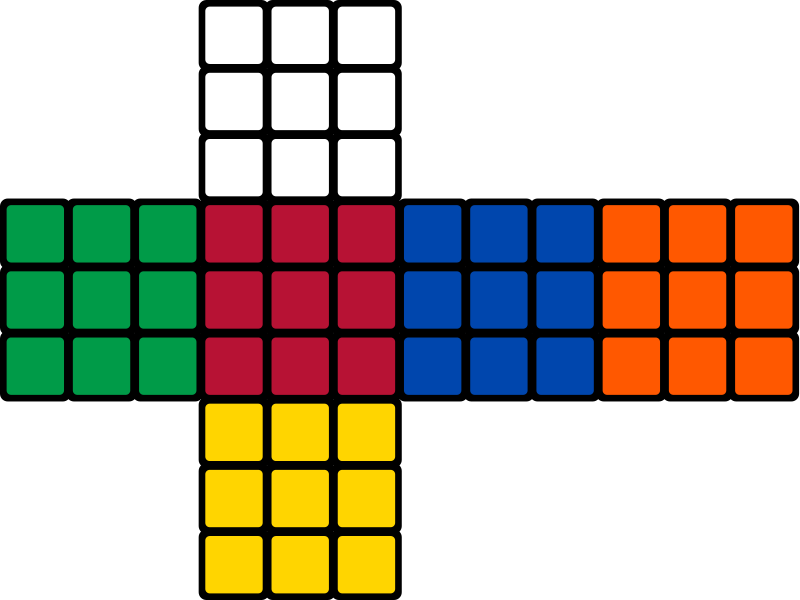
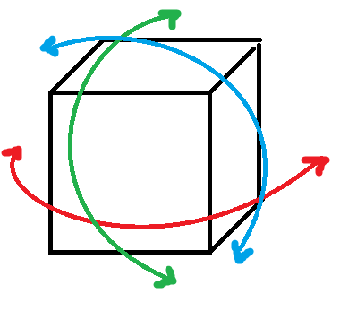

#        RUBIK'S CUBE  w/ NUMPY #

*image of a Rubik's cube net*

This is a humble implementation of a Rubik's cube, as a Python class.

The cube is made of 6 sides:
*   Front - starts colored YELLOW
*   Hind - starts colored WHITE
*   Top - starts colored RED
*   Bot - starts colored ORANGE
*   Left - starts colored GREEN
*   Right - starts colored BLUE

____________
There are a couple of methods provided to manipulate the cube, and can be seen in action in the interactive notebook file.

The methods are; 
*    rotate_up - turn secelted columns from D to U
*    rotate_down - turn selected columns from U to D
*    rotate_left - turn selected row(s) from R to L
*    rotate_right - turn selected row(s) from L to R
*    visualize - provide a image of cube's net
*    randomize - scramble the cube's tiles

____________

The cube's net, provided by the .visualize() method, represents the cube unfolded following a single **shape** (the cross shape) and **perspective** (which side is front, which is left etc.)

_______

There are 3 possible 2D planes in which a cube can be rotated

* RED ARROWS: sides move in X and Z axes

* GREEN ARROWS: sides move in Z and Y axes

* BLUE ARROWS: sides move in X and Y axes

I've simplified the nomenclature, so a rotation on the X and Z axes (red arrows) are simply invoked by calling the .rotate_left() or rotate_right(). A rotation following the green arrows is invoked by methods .rotate_up() or .rotate_down()

I've chosen the names keeping in mind the perspective of the observer, which I imagined to be perpendicular to the FRONT side

Rotations following the blue arrows aren't implemented on their own, as they are a simple combination of the forementioned methods
